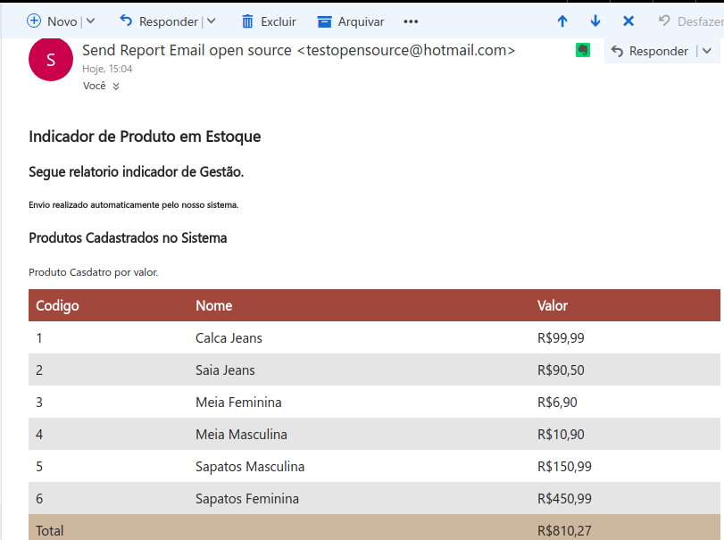
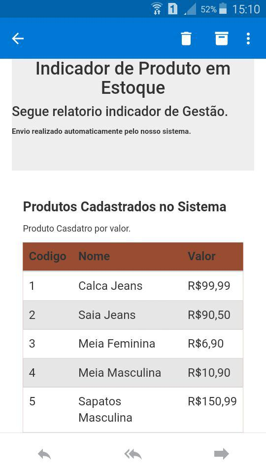

#  eReports Open Source

#### Resumo
O projeto tem como objetivo conectar em qualquer banco de dados para envio de relatórios por e-mail. Através de drive's de conexão no backend. Sendo assim, o usuário poderá nas primeiras versões escolher o drive de conexão e cadastrar um SQL e E-mail para envio do report, possibilitando o agendamento do mesmo para que seja possível rodar todos os dias ou uma vez no dia. Integração com telegram para que seja acessível uma visualização do relatório em tempo real ou atualização do mesmo, depois de criado pela interface web.

### Sucesso
Depois de executado a instalação e o teste, esse será o resultado final.

#### Outlook Web

#### Outlook Mobile

### Tecnologias Implementadas
  * VueJS :heart:
  * Docker :white_check_mark:
  * Docker-compose :white_check_mark:
  * Redis 
  * Mongodb :white_check_mark:
  * Nodejs :white_check_mark:
  * Express :white_check_mark:
  * Oracle :white_check_mark:
  * PostgreSQL
  * MySQL
  * MSSQL

### Em Processo de Desenvolvimento
  * API :heart:
  * FrontEnd :heart: VueJS

### Integração
  * Telegram

### Atenção
Projeto ainda em desenvolvimento e refatoração.

### Instalação e Teste
Pré-requisitos:
  * Docker
  * Docker-compose

Consulte a [instalação](./INSTALL.md) para obter detalhes.  

### Proxima implementação
  * Criação do frontend para agendamento dos envios e criação dos relatorios.
  * Estruturação do banco de dados para armazenamento dos script's SQL utilizando MongoDB.

### Help
Problemas ou perguntas podem ser aberto issue [aqui](https://github.com/souzacristsf/eReports-open-source/issues)

### Contribuindo 
Gostaria de fazer parte desse projeto? :heart_eyes: 
Para contruibuir com esse projeto, faça um fork do projeto e envie um pull request.

### Creditos.
[Michel Souza](https://github.com/souzacristsf)  
[Higor Diego](https://github.com/higordiego)  
[Lucas Baquião](https://github.com/lucastafarelbs)
